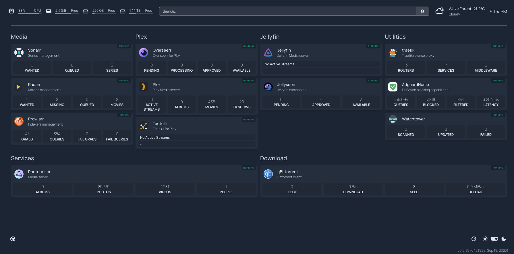

# homelab setup

Everything is running on a venerable Dell OptiPlex (Core7th i5-7500T 2.7GHz 8GB) bought $150 on ebay.
Jellyfin and photoprism supports Hardware acceleration for video encoding/decoding (x264, x265 with this intel 7th gen CPU).

- [traefik](https://traefik.io/traefik/)
- [homepage](https://gethomepage.dev/en/installation/)
- [adguard](https://adguard.com/en/welcome.html)
- [qbittorrent](https://www.qbittorrent.org)
- [sonarr](https://sonarr.tv/)
- [radarr](https://radarr.video/)
- [prowlarr](https://prowlarr.com/)
- [jellyfin](https://jellyfin.org/)
- [jellyseerr](https://github.com/Fallenbagel/jellyseerr)
- [plex](https://www.plex.tv/)
- [tautulli](https://tautulli.com)
- [overseerr](https://overseerr.dev/)
- [photoprism](https://www.photoprism.app/)
- [nordVPN](https://nordvpn.com/) if needed (I needed to reach a French based indexed with Prowlarr)



Inspired by
- https://github.com/notthebee/infra
- https://github.com/AdrienPoupa/docker-compose-nas


## Installation

```
ansible-galaxy install -r requirements.yml
```

Edit `group_vars/all/vars.yml`

```
ansible-playbook run.yml --tags system,adguard,services
```

Adguard must be configured during its 1st run on `adguard.static_ip`, port 3000. Then the service will be served on port 80.

```
ansible-playbook run.yml --tags services
```


## Service configuation

Unfortunetely, those services require the GUI to be configured (local URL + api keys):
  - qbittorrent
  - sonarr
  - radarr
  - prowlarr
  - jellyfin
  - jellyseerr
  - photoprism


# tailscale for external access

When running tailscale on the VM, you can access all the services, if external DNS us point to tailscale VM IP, with wildcard.

```
--- external DNS
*.subdomain   100.x.y.z
subdomain     100.x.y.z
```

But if you are in your local network, you must override this, by telling adguard DNS to point to the private IP, so you could avoid using tailscale when connecting to your LAN

```
--- internal DNS
*.subdomain   192.168.1.X
subdomain     192.168.1.X
```


## TODO

- when traefik is ran, get its IP
  - `docker inspect -f '{{range.NetworkSettings.Networks}}{{.IPAddress}}{{end}}' traefik`
  - So we can configure Home Assistant proxy setting in `template/homeassistant/configuration.yaml`
